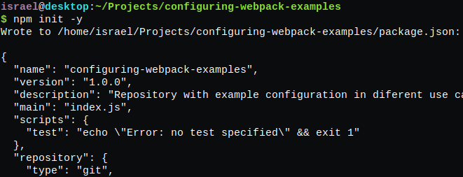
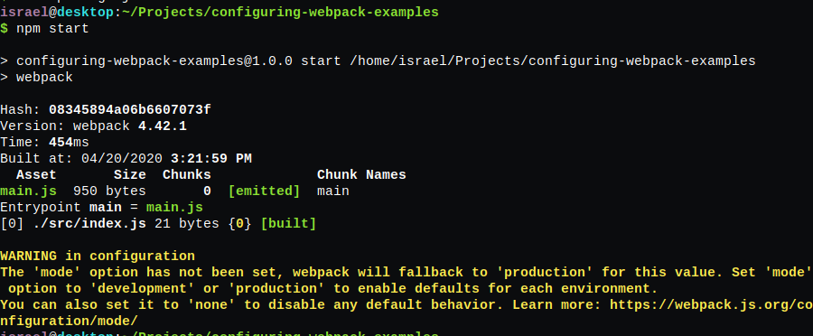

<!-- PROJECT SHIELDS -->
[![Contributors][contributors-shield]][contributors-url]
[![Forks][forks-shield]][forks-url]
[![Stargazers][stars-shield]][stars-url]
[![Issues-open][issues-open-shield]][issues-open-url]
[![Issues-closed][issues-closed-shield]][issues-closed-url]


<!-- PROJECT LOGO -->
<br />
<p align="center">
  <a href="https://webpack.js.org/">
    
  </a>

  <h1 align="center">
	Webpack setup: One JS output
  </h1>

  <p align="center">
    Learn by example how to setup a webpack web project
    <br />
	  🖊️
    <a href="https://www.theodinproject.com/courses/javascript/lessons/weather-app">Read the article</a>
    🐞
    <a href="https://github.com/Israel-Laguan/Weather-Report/issues">Report a Bug</a>
    🙋‍♂️
    <a href="https://github.com/Israel-Laguan/Weather-Report/issues">Request Feature</a>
  </p>
</p>

# The Project

Repository with example configuration in diferent use cases

# Features

- Basic VanillaJS app with a single script or few commands
- `npm` and `node` for javascript code
- `webpack` for bundling

# Prerequisites

- `npm` 6.14 +
- `node` 12.16 +
- A Text Editor like VSCode

# Getting Started

First step is to create a folder, then inside we initialize `npm`:

```bash
npm init -y
```



```bash
npm i -D webpack webpack-cli
```

If you will only need one output JS file the only remaining thing to make is a folder called src/ and inside a file called index.js. Inside of this file you can put you code, call other files and import CSS. Now please open your file called [package.json](package.json) and in the section called "scripts" like this:

```json
  "scripts": {
    "test": "echo \"Error: no test specified\" && exit 1",
    "start": "webpack"
  },
```

All that code will be output into a new file inside dist/ folder just using this command `npm start`. You'll notice the new folder and a file called main.js will be produced.



This file have already minified and uglyfy code, ready for copy/paste in your HTML! 

# 👨 Author

- [Israel Laguan](https://github.com/Israel-Laguan)

# 🤝 Contributing

Contributions, issues and feature requests are welcome!
Feel free to check the [issues page](https://github.com/Israel-Laguan/configuring-webpack-examples/issues).

# 🤗 Show your support

Give a ⭐️ if you like this project!

# 📝 License

This project is licensed under the [MIT](LICENSE)\
Feel free to fork this project and improve it

<!-- MARKDOWN LINKS & IMAGES -->
[contributors-shield]: https://img.shields.io/github/contributors/Israel-Laguan/configuring-webpack-examples?style=plastic
[contributors-url]: https://github.com/Israel-Laguan/configuring-webpack-examples/graphs/contributors
[forks-shield]: https://img.shields.io/github/forks/Israel-Laguan/configuring-webpack-examples?style=plastic
[forks-url]: https://github.com/Israel-Laguan/configuring-webpack-examples/network/members
[stars-shield]: https://img.shields.io/github/stars/Israel-Laguan/configuring-webpack-examples?style=plastic
[stars-url]: https://github.com/Israel-Laguan/configuring-webpack-examples/stargazers
[issues-open-shield]: https://img.shields.io/github/issues/Israel-Laguan/configuring-webpack-examples?style=plastic
[issues-closed-url]: https://github.com/Israel-Laguan/configuring-webpack-examples/issues
[issues-closed-shield]: https://img.shields.io/github/issues-closed/Israel-Laguan/configuring-webpack-examples?style=plastic
[issues-open-url]: https://github.com/Israel-Laguan/configuring-webpack-examples/issues